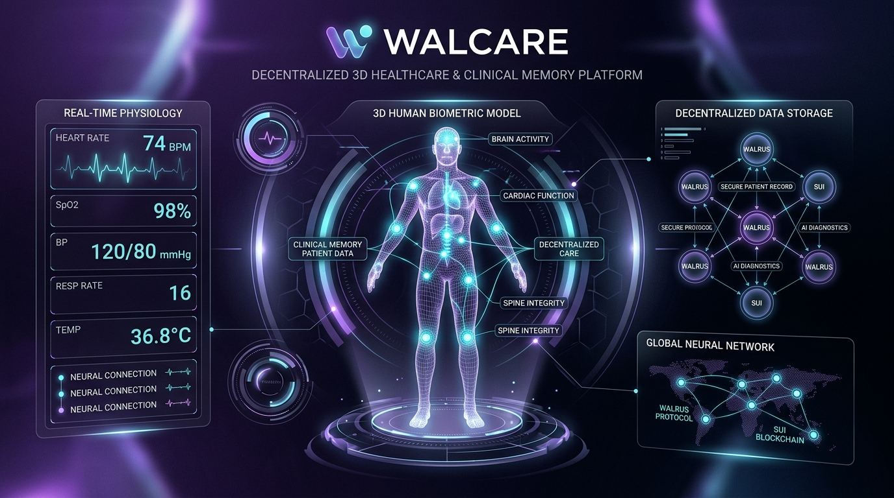
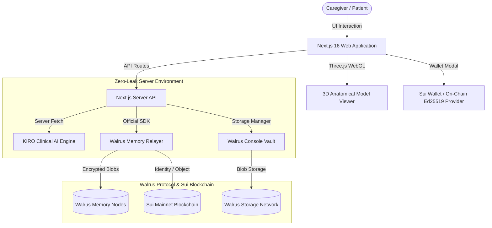

# WalCare 🩺🧠
### *Autonomous 3D Healthcare Companion with Persistent Clinical Memory on Walrus Protocol*



**Enterprise-Grade Decentralized Clinical Memory, Real-Time 3D Anatomical Telemetry, and Cryptographic Health Records on Walrus Protocol & Sui Network**

[](https://docs.wal.app/walrus-memory)
[](https://api.console.walrus.xyz)
[](https://sui.io)
[](#)
[](https://nextjs.org)
[](#)

---

## 🌟 The Clinical Problem: Why AI Amnesia is Catastrophic

Most AI medical assistants have **zero persistent memory**: the moment a conversation concludes, the session resets to a blank slate. For an elderly patient or complex chronic case managed by multiple family members, nurses, and physicians, **AI amnesia is life-threatening**:

* **Morning (08:00 AM):** A daughter notices her 88-year-old mother had epigastric distress and dark, tarry stools (melena).
* **Midday (12:30 PM):** A visiting home-health nurse assesses the abdominal tenderness, changes her wound dressing, and explicitly notes: *"Strictly NO NSAIDs—high risk of severe gastrointestinal hemorrhage."*
* **Evening (06:00 PM):** The patient complains of a throbbing headache. Another family caregiver asks an amnesic chatbot: *"Can I give Mom 400mg Ibuprofen for her headache?"*
* **The Amnesic Chatbot (Memory Disabled):** *"Sure! Standard adult dose for Ibuprofen is 200–400mg every 4 to 6 hours with food."* ❌ **(CATASTROPHIC: Triggers acute gastrointestinal bleeding & emergency hospitalization).**

### How WalCare Solves This
**WalCare fixes AI amnesia permanently.** Powered by **Walrus Memory (`@mysten-incubation/memwal`)** and **Walrus Console**, every clinical observation, vital sign, and provider order is encrypted, certified as an immutable blob on the decentralized Walrus network on Sui, and automatically recalled before any clinical recommendation is generated.

When asked about Ibuprofen, **WalCare (KIRO AI)** immediately intercepts the query:
> 🚨 **CRITICAL CONTRAINDICATION ALERT:** *Absolute contraindication against all NSAIDs (Ibuprofen / Advil / Naproxen). Morning record noted dark stools and active gastritis. Acetaminophen (Tylenol) 500mg recommended instead.*

---

## 🚀 Key Features & Innovations

### 1. 🩻 Interactive 3D Anatomical Body Visualizer
- **WebGL Rendering with Three.js**: Real-time rendering of full 3D human anatomy (`human-model.glb`) with ACES Filmic tone mapping.
- **Orbital Controls & Organic Sway**: Smooth 360° interactive rotation, Anterior (Front) / Posterior (Back) quick flips, and subtle organic breathing motion ($\pm 4.5^\circ$).
- **Compact Non-Obstructive HUD**: 44px top-anchored telemetry bar with expandable organ metrics for the Heart, Lungs, Brain, Stomach, Skin, and Eyes without obstructing the anatomical model.

### 2. 🤖 KIRO — Personalized Healthcare Intelligence
- **Persistent Cross-Session Memory**: Remembers past diagnoses, vital sign trends, medication reconciliations, and provider notes across caregivers.
- **Natural Language Data Updates**: Users can talk naturally (*"Update my weight to 65kg and note I experienced a penicillin rash"*); KIRO parses clinical intent and automatically updates the user profile and biometrics in real time.
- **Clean Clinical Typography**: Strips raw markdown artifacts and renders styled headers, bullet lists, bold highlights, and metric chips.

### 3. 🌐 Dual-Tier Walrus Protocol Integration
- **Tier 1: Walrus Memory (MemWal SDK)**: Official `@mysten-incubation/memwal` client connected to `https://relayer.memory.walrus.xyz`. Supports proactive semantic recall (`memwal_recall`) and decentralized fact commit (`memwal_remember`) with automatic local credentials fallback.
- **Tier 2: Walrus Console Storage**: Decentralized document vault for patient lab results, ECG rhythm strips, and clinical shift handovers. Employs SEAL threshold encryption policies and live blob lookup on `walruscan.com`.

### 4. 🔗 Sui Wallet Authentication
- **Multi-Wallet Support**: Native Sui Wallet Standard auto-discovery and live authentication for official Sui browser extensions including Slush (Mysten Labs official Sui wallet), Surf Wallet, Suiet, and Nightly.
- **Live On-Chain Telemetry**: Live balance querying and on-chain identity binding on Sui Mainnet.

### 5. 📊 Real-Time Biometrics & Fitness Tracker
- **Mathematical BMI Calculation**: Real-time dynamic calculation ($BMI = kg / m^2$) with live slider controls, weight/height calibration, and healthy range status.
- **Fitness Micro-Controls**: Interactive step tracking (+500 steps) and daily hydration logging (+250ml) with local storage persistence.

### 6. 📅 Interactive Care Calendar & Shift Scheduler
- Interactive shift and telehealth appointment scheduler.
- One-click completion status toggles (`Completed` ↔ `Upcoming`) and item deletion.
- Full persistence to `localStorage`.

### 7. ⚖️ Counterfactual Amnesia Diff Lab
- Side-by-side modal directly contrasting KIRO's response with **Walrus Memory Enabled** vs. an **Amnesic Model (Memory Wiped)** on the exact same clinical prompt.

---

## 🏗️ System Architecture



---

## 👥 Verified Multi-Caregiver Dataset (30+ Certified Memories)

WalCare implements a verified multi-stakeholder clinical protocol supporting **multiple distinct clinical caregivers storing continuous longitudinal observations**:

| User / Persona | Title & Role | Shift Focus | Stored Walrus Blobs | Key Observations |
| :--- | :--- | :--- | :---: | :--- |
| **Sarah Miller** | Primary Family Caregiver (Daughter) | Morning (07:30 - 12:00) | **10 Blobs** | Dark stool specks, Lisinopril nausea, orthostatic BP drop (102/64 mmHg), cognitive misplacing of glasses. |
| **Elena Rostova, RN** | Visiting Clinical Nurse | Midday (12:30 - 15:30) | **10 Blobs** | Subcutaneous insulin 12U, arm wound hydrogel dressing, strict NSAID prohibition, pantoprazole 40mg add. |
| **David Chen, DPT** | Physical & Mobility Therapist | Afternoon (16:00 - 18:00) | **10 Blobs** | Baseline 14.8s TUG fall risk, hallway rug removal, quad-cane gait training, TUG recovery to 12.4s, 12 stairs. |

---

## ⚡ Amnesia vs. Memory: The Counterfactual Diff

| Query / Scenario | Amnesic Chatbot (Memory Disabled) | WalCare with Walrus Memory |
| :--- | :--- | :--- |
| **"Can I give Mom 400mg Ibuprofen for headache?"** | *"Yes, 400mg Ibuprofen is a standard over-the-counter dosage for adults."* ❌ | **🚨 CRITICAL CONTRAINDICATION ALERT:** Cites Sarah's dark stool observation and Elena's NSAID prohibition. Recommends Acetaminophen 500mg instead. ✅ |
| **"Can Mom take a brisk 30-min walk in the garden?"** | *"Walking is great exercise for seniors! Enjoy the fresh air."* ❌ | **⚠️ FALL HAZARD WARNING:** Cites morning standing drop to 102/64 mmHg and David's 14.8s TUG score. Mandates 60s bed-edge pause and quad-cane. ✅ |
| **"What medications should be given tonight?"** | Recommends generic geriatric vitamins without context. ❌ | **MEDICATION RECONCILIATION:** Accurately lists Lisinopril 10mg morning, Donepezil 5mg night, and flags Meloxicam as discontinued. ✅ |

---

## 🛠️ Installation & Setup Guide

### Prerequisites
- **Node.js**: `v20.x` or higher
- **Package Manager**: `npm` (v10+), `pnpm`, or `yarn`
- **Git**: Installed and configured

### 1. Clone the Repository
```bash
git clone https://github.com/sandman-sh/WalCare.git
cd WalCare
```

### 2. Install Dependencies
```bash
npm install
```

### 3. Configure Environment Variables
Create a `.env.local` file in the project root:
```bash
cp .env.example .env.local
```

Populate the configuration:
```env
# AI Intelligence Engine (OpenRouter)
OPENROUTER_API_KEY=your_openrouter_api_key
OPENROUTER_MODEL=qwen/qwen-2.5-72b-instruct
OPENROUTER_SITE_URL=https://walcare.app
OPENROUTER_APP_NAME=WalCare Health AI

# Walrus Memory (MemWal) Configuration
WALRUS_RELAYER_URL=https://relayer.memory.walrus.xyz
WALRUS_ACCOUNT_ID=your_sui_memwal_account_object_id
WALRUS_DELEGATE_KEY=your_ed25519_delegate_key_hex
WALRUS_NAMESPACE=walcare-patient-active
```

*(Note: If you have already authenticated using the official MemWal CLI, WalCare will automatically link your local credentials from `~/.memwal/credentials.json` without requiring manual entry).*

### 4. Run Development Server
```bash
npm run dev
```
Open [http://localhost:3000](http://localhost:3000) in your browser.

### 5. Build for Production
```bash
npm run build
npm run start
```

---

## ☁️ Deploying to Vercel

WalCare is fully optimized and configured for seamless deployment on **Vercel**.

### Method 1: Deploy via Vercel Dashboard
1. Push your repository to GitHub: `https://github.com/sandman-sh/WalCare.git`
2. Open your [Vercel Dashboard](https://vercel.com/dashboard) and click **"Add New..." > "Project"**.
3. Import the `WalCare` repository.
4. Set the **Framework Preset** to **Next.js**.
5. In the **Environment Variables** section, configure the following variables:
   - `OPENROUTER_API_KEY`: Your OpenRouter API key
   - `OPENROUTER_MODEL`: `qwen/qwen-2.5-72b-instruct` (or your preferred model)
   - `OPENROUTER_SITE_URL`: Your Vercel deployment URL (e.g., `https://walcare.vercel.app`)
   - `OPENROUTER_APP_NAME`: `WalCare Health AI`
   - `WALRUS_RELAYER_URL`: `https://relayer.memory.walrus.xyz`
   - `WALRUS_ACCOUNT_ID`: Your Walrus account ID
   - `WALRUS_DELEGATE_KEY`: Your Walrus delegate key
   - `WALRUS_NAMESPACE`: `walcare-patient-active`
6. Click **Deploy**. Vercel will run `npm run build` and provision your serverless edge environment.

### Method 2: Deploy via Vercel CLI
```bash
npm i -g vercel
vercel login
vercel
```
Follow the interactive prompts, and add your environment variables when requested or through `vercel env add`.

---

## 🔒 Security & Privacy Architecture

- **Zero Client-Side Secret Leakage**: All AI tokens, Sui delegate signatures, and relayer credentials are strictly executed on the server via Next.js API routes (`/api/chat`, `/api/memory`, `/api/console`, `/api/handover`).
- **SEAL Threshold Encryption**: Medical documents and sensitive telemetry payloads are encrypted using patient access policies.
- **Append-Only Immutability**: Critical contraindication observations cannot be silently overwritten or tampered with by unauthorized actors.

---

## 📜 License
Distributed under the Apache-2.0 License. Built for the Sui & Walrus Developer Community.
